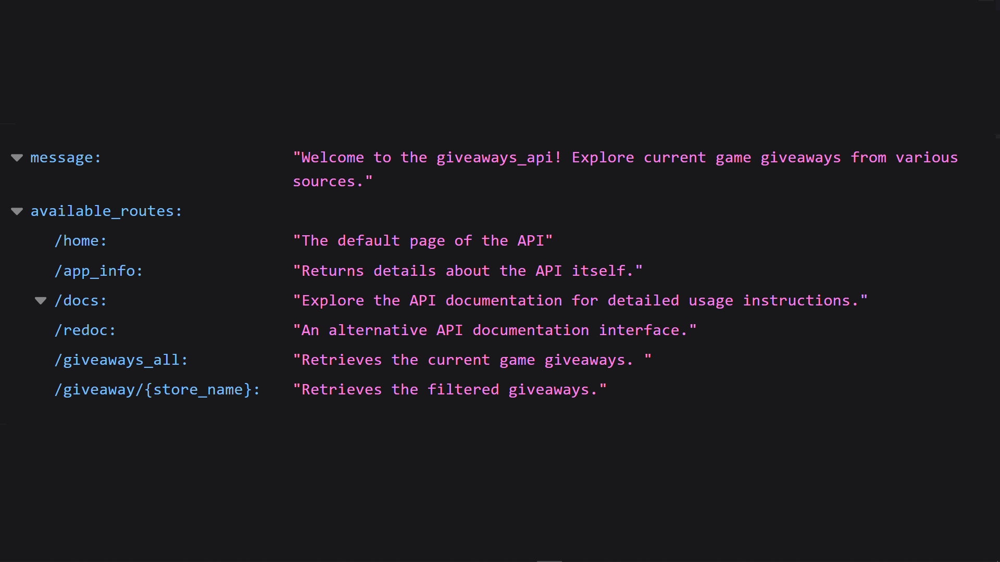
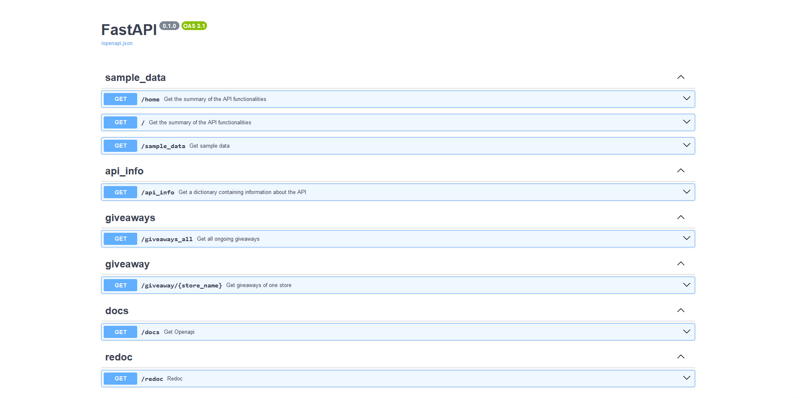
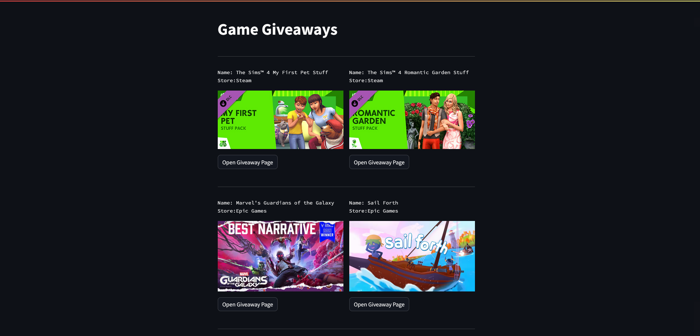

---

## Overview

**Welcome to Game Giveaways API!**

Here you can explore and discover game giveaways from popular platforms from various game stores (Steam, Epic Games,
etc.).
This API utilizes the best of modern technologies to provide a seamless and efficient experience for users.
Since the code is highly scalable, integrating other giveaway sources will be a breeze.

---

## Business Logic

The business logic is designed to parse sources using `Selenium` with Chrome webdriver, and to extract information using
`BeautifulSoup` and `Regex`.

> _To ensure maximum stability, selection by the HTML tags are being used, instead of XPath. And by the same reason,
besides the HTML tags,
**all the constant values,** that should be hardcoded, **could be found in `config.py` file in the root folder**._

Once `Selenium` detected and extracted the HTML blocks, it handles the code to `Beautiful Soup` for further analysis and
data extraction.

> _Additionally, `Selenium` saves the scraped data to HTML files by `business_logic/parser/data/scrapped_data`, with the
date as a filename.
However, this feature is designed for users who need to create statistical charts, etc., and is not utilized by the
business logic afterward._

Each of the game stores has its own classes, and thanks to the ready-to-use parent class methods for finding the title,
URL, and picture URL of the game in HTML code, integrating new stores will be straightforward.

Then, each of the stores calls the corresponding parent class methods to extract data.

> _Additionally, if there is a need to modify the logic/technique of data extraction, you can easily override the parent
method._

Once the data is ready, the controller classes, named `StoreName + Main`, ensure encapsulation and, through composition,
shield users from intricate details, offer a single method, `get_giveaways`, is ready to deliver data on demand.

- The output is a dictionary in the format of `{"store_name_giveaways":[]}`.

All controller classes are merged into one `Giveaways` class, which calls the `get_giveaways` method for each Store
class,
updates a local dictionary within it, and then returns the result in accordance with ASGI and pydantic.

- The key of the returning dictionaries for all endpoints is `'response'`.

**_Example:_**

```
{
    "response": {
        "steam_giveaways": [
            {
                "title": "Ready or Not",
                "image_url": "https://cdn.cloudflare.steamstatic.com/steam/apps/1144200/header.jpg",
                "game_url": "https://store.steampowered.com/app/1144200/"
            }
        ],
        
        "epic_games_giveaways": [
            {
                "title": "Marvel’s Guardians of the Galaxy",
                "image_url": "https://cdn1.epicgames.com/offer/2a09fb19b47f46dfb11ebd382f132a8f/EGS_MarvelsGuardiansoftheGalaxy_EidosMontral_S1_01_2560x1440-41457c6140198776b348b1c77e730e48",
                "game_url": "https://store.epicgames.com/en-US/p/marvels-guardians-of-the-galaxy"
            }
        ]
    }
}
```

**_Brief summary:_**
> 1. Selenium accesses the websites detects, extracts and saves the needed HTML block.
> 2. BeautifulSoup and Regex extract information out of HTML block.
> 3. Parsed information is being stored in a dictionary.


---

## API

- The API is built on `FastAPI`.
- It supports `Redoc` and `SwaggerUI`, as well it has endpoints (`/home`, `/`) containing `custom documentation` .

- All endpoints are defined separately in the `views` folder, and connected to main app as `routers`.
- All endpoints are protected by an **_original_** `rate limiting` script as a `middleware`.
    - This rate-limiting mechanism controls the number of requests from each user. By default, the interval is set to 5
      seconds. Users have the flexibility to modify this value by providing a time interval parameter in their requests.
- `CORS` is enabled for wider accessibility.

| `/home` endpoint:                     |
|---------------------------------------|
|  |

| `/docs` endpoint:                                   |
|-----------------------------------------------------|
|  |

---

## Cache

The cache is generated once a day, synchronized with USA time.
The API script first checks the data in cache if it's up-to-date, if it is - retrieves it, if not - triggers the parser. 


---

## Testing

The tests are integration,based on returned values, and their types/formats. They are: 

- Business logic tests
- API functioning tests

Informative testing-related errors, such as: `ApiIsOff: Turn on API before testing it!`

---

## Demo

Explore the API's response visualization with the provided ui_demo file in the root directory, showcasing a quick
overview using Streamlit.

UI visualization example:

- 

```commandline
streamlit run ui_demo.py
```

---

## Known Issues

Two Selenium-related issues are addressed: NotMatchingDriverVersion is handled by the original install-helper script,
and BrowserNotFound requires manual Chrome browser download. If the API returns None instead of game names, inspect the
website and update container tags in the config file.

---

## Configuration

The config package contains variables subject to change over time, enhancing the user experience.

---

## Technologies

Technologies used for this project include FastAPI, Selenium, BeautifulSoup4, and more.

Get started and enjoy exploring free games with the Game Giveaways API!

---

## Cool Features and tips that you will discover

- Selenium tip: how to get rid of "Browser is being controlled by automated test software"
- Selenium tip: how to run the browser in maximized window?  
- Selenium tip: how to use manageable Chrome for testing instead of Google Chrome?
- Scraping tip: how to bypass Cloudflare.
- Scraping tip: how to not trigger Google anti-bot check.
- Scraping tip: how to detect and analyze the HTML code using Selenium itself.
- Logging tip: how to set the logging pipeline.
- Security tip: how to protect the API from DDOS attacks.
- Security tip: how to protect the API from SQL-injections.
- API: how to develop a modern API in accordance with REST principles.
- Backend tip: how to create an independent and loose-coupled OOP code in accordance with all OOP principles.
- Backend tip: how to manage the architecture of the business logic in accordance with polymorphism.

# IMPORTANT

Download the folder [`webdriver`](https://drive.google.com/file/d/1VHUmhxt0ifRoipIpOT93VRsR6JnJ6AiA/view?usp=sharing) and unpack at and unpack at `configs/tools` or download Chrome for testing and Chromedriver manually and move to the mentioned folder.
